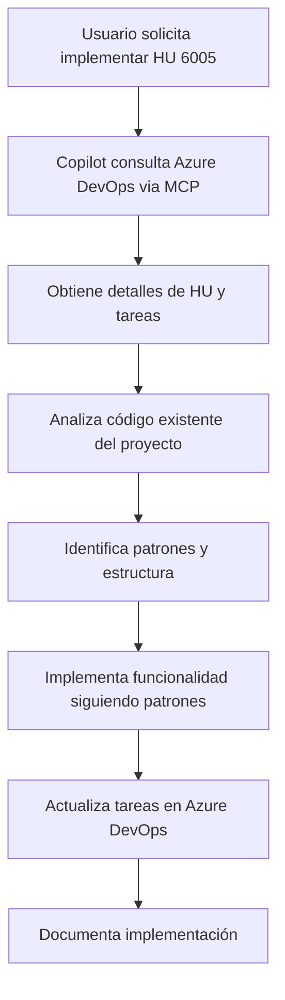

# Prompt Template para GitHub Copilot con Azure DevOps MCP

## Información de Contexto
- **Historia de Usuario ID**: 6005
- **Título**: HU: Visualizar Estadística General
- **Sprint**: sprint 6.1
- **Área de Valor**: Business
- **Story Points**: 2

## Descripción de la Historia de Usuario

**Como** Administrador  
**Quiero** observar datos generales de la EPN  
**Para** conocer el estado actual de la EPN

## Tareas de Backend Identificadas

### Tarea 6048 ✅ (Completada)
- **Título**: [BE] Crear endpoint GET /dashboard/counts
- **Estado**: Closed
- **Asignado**: JOSE DAVID TERAN RAMOS

### Tarea 6049 🔄 (Pendiente)
- **Título**: [BE] Implementar lógica para obtener total de Facultades
- **Estado**: New
- **Asignado**: JOSE DAVID TERAN RAMOS

### Tarea 6050 🔄 (Pendiente)
- **Título**: [BE] Implementar lógica para obtener total de Carreras
- **Estado**: New
- **Asignado**: JOSE DAVID TERAN RAMOS

### Tarea 6061 🔄 (Pendiente)
- **Título**: [BE] Implementar lógica para obtener total de Usuarios Activos
- **Estado**: New
- **Asignado**: JOSE DAVID TERAN RAMOS

## Arquitectura del Proyecto Actual

```typescript
// Tecnologías identificadas:
- Framework: NestJS
- ORM: Sequelize con TypeScript
- Base de Datos: PostgreSQL
- Autenticación: JWT Guards
- Documentación: Swagger/OpenAPI
- Estructura: Modular por dominio

// Modelos existentes:
- UsuarioModel (usuarios)
- FacultadModel (facultades)
- CarreraModel (carreras)
- AuditoriaEventoModel (auditoria_eventos)

// Módulos existentes:
- DashboardModule ✅
- UsuariosModule ✅
- FacultadesModule ✅
- CarrerasModule ✅
- AuthModule ✅
```

## Criterios de Aceptación Técnicos

### Endpoint Requerido
```typescript
GET /dashboard/counts
Authorization: Bearer {jwt_token}

Response Schema:
{
  "totalFacultades": number,
  "totalCarreras": number,
  "totalUsuariosActivos": number,
  "ultimaActualizacion": string (ISO date)
}
```

### Especificaciones de Implementación

1. **Controller** (`/src/dashboard/dashboard.controller.ts`)
   - Nuevo endpoint `@Get('counts')`
   - Documentación Swagger completa
   - Autenticación con `@UseGuards(JwtAuthGuard)`
   - Respuesta tipada con DTO

2. **Service** (`/src/dashboard/dashboard.service.ts`)
   - Método `getDashboardCounts()`
   - Consultas optimizadas a la base de datos
   - Manejo de usuarios activos (estadoActivo = true)

3. **DTOs** (crear nuevo archivo)
   - `DashboardCountsDto` para response
   - Validaciones con class-validator
   - Documentación con @ApiProperty

## Requerimientos Específicos por Criterio de Aceptación

### Escenario 2: Total de Facultades
```sql
-- Lógica requerida:
SELECT COUNT(*) FROM facultades WHERE estadoActivo = true;
```

### Escenario 3: Total de Carreras
```sql
-- Lógica requerida:
SELECT COUNT(*) FROM carreras WHERE estadoActivo = true;
```

### Escenario 4: Total de Usuarios Activos
```sql
-- Lógica requerida:
SELECT COUNT(*) FROM usuarios WHERE estadoActivo = true;
```

## Patrones del Proyecto a Seguir

### 1. Estructura de Controller
```typescript
@ApiTags('Dashboard')
@ApiBearerAuth('bearer')
@UseGuards(JwtAuthGuard)
@Controller('dashboard')
export class DashboardController {
  @Get('endpoint')
  @ApiOperation({ summary: 'Descripción clara' })
  @ApiResponse({ status: 200, description: 'Success response', type: ResponseDto })
  async methodName(@GetUser() usuario: UsuarioModel): Promise<ResponseDto> {
    return this.service.methodName(usuario);
  }
}
```

### 2. Estructura de Service
```typescript
@Injectable()
export class ServiceName {
  constructor(
    @InjectModel(ModelName) private readonly model: typeof ModelName,
  ) {}
  
  async methodName(): Promise<ReturnType> {
    // Lógica de negocio
    return result;
  }
}
```

### 3. Estructura de DTO
```typescript
export class ResponseDto {
  @ApiProperty({ description: 'Campo descripción', example: 'valor ejemplo' })
  field: type;
}
```

## Instrucciones para GitHub Copilot

### Comando Principal
```
Implementa la funcionalidad de dashboard counts para la HU 6005 siguiendo estos pasos:

1. **Análisis**: Revisa la estructura actual del DashboardModule
2. **DTO**: Crea DashboardCountsDto con las propiedades requeridas
3. **Service**: Implementa getDashboardCounts() con consultas optimizadas
4. **Controller**: Agrega endpoint GET /dashboard/counts con documentación Swagger
5. **Validación**: Asegura autenticación y manejo de errores
6. **Azure DevOps**: Actualiza estado de tareas 6049, 6050, 6061 a "Closed"
```

### Consideraciones Especiales

1. **Performance**: Usar consultas COUNT() optimizadas
2. **Seguridad**: Solo administradores pueden acceder a estas estadísticas
3. **Caching**: Considerar implementar cache para reducir carga en BD
4. **Auditoria**: Registrar acceso a estadísticas en AuditoriaEventoModel
5. **Consistencia**: Mantener naming conventions del proyecto

### Validaciones Requeridas

- ✅ Endpoint documentado con Swagger
- ✅ Autenticación JWT implementada
- ✅ DTOs con validaciones apropiadas
- ✅ Manejo de errores consistente
- ✅ Consultas optimizadas a la base de datos
- ✅ Respuesta en formato JSON estándar
- ✅ Tests unitarios (opcional pero recomendado)

### Resultado Esperado

Al completar la implementación:

1. **Funcionalidad**: Endpoint `/dashboard/counts` operativo
2. **Documentación**: Swagger actualizado automáticamente
3. **Trazabilidad**: Tareas de Azure DevOps marcadas como completadas
4. **Consistencia**: Código siguiendo patrones del proyecto
5. **Calidad**: Sin errores de compilación o linting

## Flujo de Trabajo MCP



## Comandos MCP Utilizados

```typescript
// Consulta inicial
mcp_ado_wit_get_work_item({ project: "ProyectoDTIC", id: 6005, expand: "all" })

// Obtener tareas relacionadas
mcp_ado_wit_get_work_items_batch_by_ids({ 
  ids: [6049, 6050, 6061], 
  project: "ProyectoDTIC" 
})

// Actualizar estado al completar
mcp_ado_wit_update_work_item({
  id: 6049,
  updates: [{ op: "replace", path: "/fields/System.State", value: "Closed" }]
})
```

---

**Nota**: Este prompt está diseñado para ser utilizado por GitHub Copilot en conjunto con Azure DevOps MCP, proporcionando un flujo de desarrollo completo desde requerimientos hasta implementación.